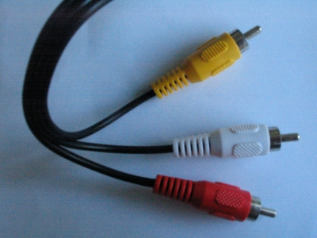

# Hifi oplossingen

## Klassieke radiovesterker

# Begrippen

## RCA stekker

Wordt ook tulp- of cinchstekker genoemd.
Dit zie je aan de achterzijde van een klassieke versterker voor
audio line in, audio line out en phono in.

## Ethernet

## Bluetooth

 

# Winkels

* [https://tebahifi.be/](https://tebahifi.be/)
* [https://www.hifiklubben.nl/](https://www.hifiklubben.nl/)

# Websites met reviews

* [https://www.musicradar.com/](https://www.musicradar.com/)
    + [https://www.musicradar.com/news/the-best-studio-monitors-and-monitor-speakers](https://www.musicradar.com/news/the-best-studio-monitors-and-monitor-speakers)

        Een bespreking van studioluidsprekers, met o.a. Genelec
* [https://hifi.be/](https://hifi.be/)
* [https://www.alpha-audio.nl/review/](https://www.alpha-audio.nl/review/)
* [https://hifipig.com/category/hifi-reviews/](https://hifipig.com/category/hifi-reviews/)
* [https://www.hifi-advice.com/blog/](https://www.hifi-advice.com/blog/)
* [https://nl-be.trustpilot.com/review/www.stassen.nl](https://nl-be.trustpilot.com/review/www.stassen.nl)
* [https://hifiplus.com/reviews/](https://hifiplus.com/reviews/)
* [https://darko.audio/](https://darko.audio/)
* [https://www.hifinews.com/reviews](https://www.hifinews.com/reviews)
* [https://www.audiosciencereview.com/forum/index.php](https://www.audiosciencereview.com/forum/index.php)
* [https://www.stevehuffphoto.com/all-reviews/hi-fi-reviews/](https://www.stevehuffphoto.com/all-reviews/hi-fi-reviews/)
* [https://stereo-magazine.com/reviews](https://stereo-magazine.com/reviews)
* [https://www.hifichoice.com/reviews](https://www.hifichoice.com/reviews)
* [https://hifi-opinions.com/nl/category/hifi-reviews-nl/](https://hifi-opinions.com/nl/category/hifi-reviews-nl/)
* [https://tweakers.net/](https://tweakers.net/)
* [http://www.hifi-review.com/](http://www.hifi-review.com/)
* [https://hifiandmusicsource.com/](https://hifiandmusicsource.com/)
* [https://www.kieskeurig.nl/winkels/hifi_klubben/reviews](https://www.kieskeurig.nl/winkels/hifi_klubben/reviews)
* [https://www.stereophile.com/equipmentreviews](https://www.stereophile.com/equipmentreviews)
* [https://www.soundstagehifi.com/index.php/equipment-reviews](https://www.soundstagehifi.com/index.php/equipment-reviews)
* [https://www.mrhifireviews.com/](https://www.mrhifireviews.com/)
* [https://audiomix.be/](https://audiomix.be/)
* [https://hifiguides.com/](https://hifiguides.com/)
* [https://www.soundguys.com/tidal-hifi-review-25846/](https://www.soundguys.com/tidal-hifi-review-25846/)
* [https://headfonics.com/](https://headfonics.com/)
* [https://majorhifi.com/](https://majorhifi.com/)
* [https://hifitrends.com/category/reviews/](https://hifitrends.com/category/reviews/)

